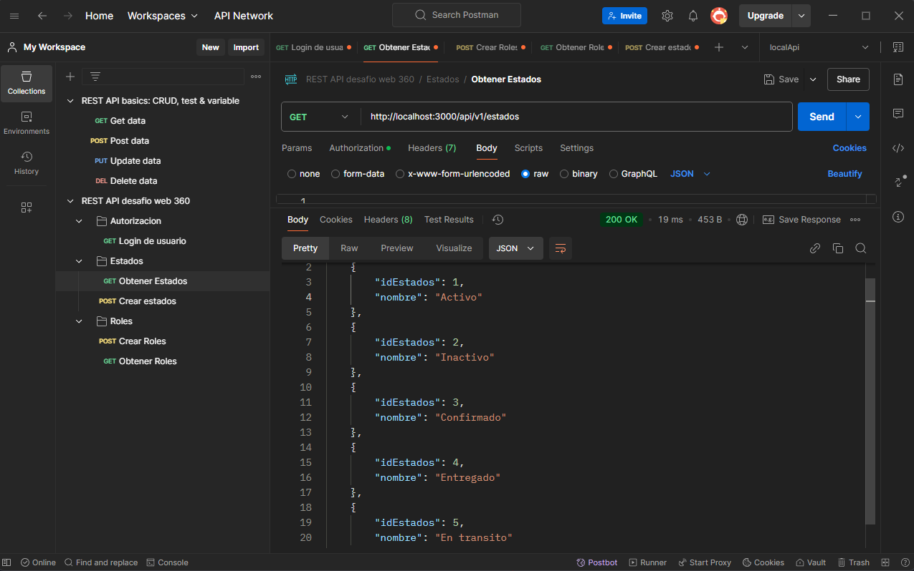
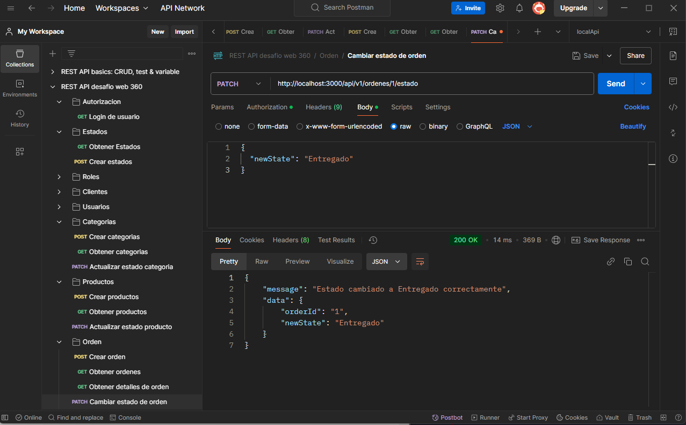

# Validación de Endpoints de la API con Postman

Para poder acceder a la API se debe iniciar sesión con las credenciales correctas y obtener un token valido.

## Endpoints Probados

### 1 Autorizacion

1.1 **GET /login**  
   `http://localhost:3000/api/v1/login`

- **Prueba:** Inicio de sesión con credenciales válidas e inválidas.
  - **Credenciales:**

     ```json
     {
         "email": "admin@empresa.com",
         "password": "passadmin128"
     }
     ```

- Resultado:


- Prueba: Inicio de sesión con credenciales invalidas.
- Resultado:


### 2 Estados

2.1 **POST /Crear estados**  
    `http://localhost:3000/api/v1/estados`

- **Prueba:** Creacion de estados
  - **Datos:**

    ```json
      {
          "name": "Inactivo"
      }

      {
          "name": "Confirmado"
      }

      {
          "name": "Entregado"
      }

      {
          "name": "En transito"
      }
     ```

- Resultado:


2.2 **GET /Obtener estados**  
    `http://localhost:3000/api/v1/estados`

- Prueba: Obtener estados con credenciales validas.
- Resultado:



### 3 Roles

3.1 **POST /Crear roles**  
    `http://localhost:3000/api/v1/roles`

- **Prueba:** Creacion de roles
  - **Datos:**

    ```json
      {
          "name": "Operador"
      }

      {
          "name": "Cliente"
      }
     ```

- Resultado:


3.2 **GET /Obtener roles**  
    `http://localhost:3000/api/v1/roles`

- Prueba: Obtener roles con credenciales validas.
- Resultado:


### 4 Clientes

4.1 **POST /Crear clientes**  
    `http://localhost:3000/api/v1/clientes`

- **Prueba:** Creacion de clientes (solo los usuarios con el rol de Administrador u Operador pueden crear usuarios)
  - **Datos:**

    ```json
    //1
    {
      "name": "Corporación XYZ S.A.",
      "tradeName": "XYZ Comercial",
      "address": "Av. Central, 5to. Piso, Ciudad",
      "phone": "14567890",
      "email": "contacto@xyz.com"
    }

    //2
      {
      "name": "Soluciones Globales S.A.",
      "tradeName": "Soluciones Globales",
      "address": "Calle Principal, Ciudad",
      "phone": "97654321",
      "email": "info@solucionesglobales.com"
    }

    //3
    {
      "name": "Tecnologías Avanzadas S.A.",
      "tradeName": "Tech Avanzada",
      "address": "Av. Metropolitana, Oficina 302, Ciudad",
      "phone": "47890123",
      "email": "atencion@techavanzada.com"
    }

    //4
    {
      "name": "Distribuidora El Buen Precio S.A.",
      "tradeName": "Buen Precio",
      "address": "Av. Industrial, Zona 10, Ciudad",
      "phone": "36549870",
      "email": "ventas@buenprecio.com"
    }

    //5
    {
      "name": "Servicios Financieros G.B.",
      "tradeName": "Finanzas G.B.",
      "address": "Calle Reforma, Zona 3, Ciudad",
      "phone": "63218765",
      "email": "contacto@finanzasgb.com"
    }

    //6
    {
      "name": "Consultora Crecimiento Empresarial S.A.",
      "tradeName": "Crecimiento Empresarial",
      "address": "Calle Principal, Zona 1, Ciudad",
      "phone": "70123456",
      "email": "consultoria@crecimientosa.com"
    }

    //7
    {
      "name": "Comercio Digital S.A.",
      "tradeName": "Comercio Digital",
      "address": "Av. Cultural, Zona 8, Ciudad",
      "phone": "10987654",
      "email": "info@comerciodigital.com"
    }

    //8
    {
      "name": "Grupo Innovación Tecnológica",
      "tradeName": "Innovación Tech",
      "address": "Av. Central, 2do. Piso, Ciudad",
      "phone": "25678901",
      "email": "soporte@innovaciontech.com"
    }

    //9
    {
      "name": "Distribuciones La Montaña",
      "tradeName": "Distribuciones Montaña",
      "address": "Calle Central, Zona 10, Ciudad",
      "phone": "58901234",
      "email": "ventas@distribucionesmontana.com"
    }

    //10
    {
      "name": null,
      "tradeName": "Comercio Online",
      "address": "Calle Reformador, Zona 8, Ciudad",
      "phone": "12334455",
      "email": "contacto@comercioonline.com"
    }
     ```

- Resultado:


4.2 **GET /Obtener clientes**  
    `http://localhost:3000/api/v1/clientes`

- Prueba: Obtener clientes con credenciales validas.
- Resultado:


4.3 **PUT /Actualizar un cliente**  
    `http://localhost:3000/api/v1/clientes/10`

- Prueba: Actualizar un cliente.
  - **Datos:**

    ```json
    {
      "name": null,
      "tradeName": "Comercio Online-GT",
      "address": "Calle La Floresta, Zona 4, Ciudad",
      "phone": "12334455",
      "email": "contacto@comercioonline.com.gt"
    }
     ```

- Resultado:


### 5 Usuarios

5.1 **POST /Crear usuario**  
    `http://localhost:3000/api/v1/register`

- **Prueba:** Creacion de usuarios (solo los usuarios con el rol de Administrador u Operador pueden crear usuarios)
  - **Datos:**

    ```json
    //2
    {
      "rol": "Operador",
      "state": "Activo",
      "email": "luis_g@empresa.com",
      "fullName": "Luis Gonzales",
      "password": "operador2023",
      "phone": "96543210",
      "dateOfBirth": "1995-06-20",
      "customerId": null
    }
    //3
    {
      "rol": "Cliente",
      "state": "Activo",
      "email": "contacto@xyz.com",
      "fullName": "Corporación XYZ S.A.",
      "password": "cliente123",
      "phone": "14567890",
      "dateOfBirth": "1989-10-05",
      "customerId": 1
    }
    //4
    {
      "rol": "Operador",
      "state": "Activo",
      "email": "ana.gomez@empresa.com",
      "fullName": "Ana Gomez",
      "password": "secure2023",
      "phone": "70123456",
      "dateOfBirth": "1990-04-12",
      "customerId": null
    }
    //5
    {
      "rol": "Cliente",
      "state": "Activo",
      "email": "info@solucionesglobales.com",
      "fullName": "Soluciones Globales S.A.",
      "password": "soluciones2023",
      "phone": "97654321",
      "dateOfBirth": "1993-03-25",
      "customerId": 2
    }
    //6
    {
      "rol": "Cliente",
      "state": "Activo",
      "email": "atencion@techavanzada.com",
      "fullName": "Tecnologías Avanzadas S.A.",
      "password": "tech2023",
      "phone": "47890123",
      "dateOfBirth": "1990-03-19",
      "customercustomerId": 3
    }
    //7
    {
      "rol": "Operador",
      "state": "Activo",
      "email": "carlos.lopez@empresa.com",
      "fullName": "Carlos Lopez",
      "password": "operador456",
      "phone": "60983210",
      "dateOfBirth": "1997-08-30",
      "customerId": null
    }
    //8
    {
      "rol": "Cliente",
      "state": "Activo",
      "email": "ventas@buenprecio.com",
      "fullName": "Distribuidora El Buen Precio S.A.",
      "password": "buenprecio2023",
      "phone": "36549870",
      "dateOfBirth": "1992-09-08",
      "customerId": 4
    }
    //9
    {
      "rol": "Cliente",
      "state": "Activo",
      "email": "contacto@finanzasgb.com",
      "fullName": "Servicios Financieros G.B.",
      "password": "finanzas123",
      "phone": "63218765",
      "dateOfBirth": "1990-12-22",
      "customerId": 5
    }
    //10
    {
      "rol": "Cliente",
      "state": "Activo",
      "email": "consultoria@crecimientosa.com",
      "fullName": "Consultora Crecimiento Empresarial S.A.",
      "password": "crecimiento2023",
      "phone": "70123456",
      "dateOfBirth": "1985-11-15",
      "customerId": 6
    }
    //11
    {
      "rol": "Cliente",
      "state": "Activo",
      "email": "info@comerciodigital.com",
      "fullName": "Comercio Digital S.A.",
      "password": "comercio2023",
      "phone": "10987654",
      "dateOfBirth": "1991-07-28",
      "customerId": 7
    }
    //12
    {
      "rol": "Cliente",
      "state": "Activo",
      "email": "soporte@innovaciontech.com",
      "fullName": "Grupo Innovación Tecnológica",
      "password": "innovacion2023",
      "phone": "25678901",
      "dateOfBirth": "1988-06-12",
      "customerId": 8
    }
    //13
    {
      "rol": "Cliente",
      "state": "Activo",
      "email": "ventas@distribucionesmontana.com",
      "fullName": "Distribuciones La Montaña",
      "password": "montana2023",
      "phone": "58901234",
      "dateOfBirth": "1994-04-03",
      "customerId": 9
    }
    //14
    {
      "rol": "Cliente",
      "state": "Activo",
      "email": "contacto@comercioonline.com",
      "fullName": "Comercio Online",
      "password": "online2023",
      "phone": "12334455",
      "dateOfBirth": "1992-02-14",
      "customerId": 10
    }
    //15
    {
      "rol": "Operador",
      "state": "Activo",
      "email": "eli.moreno@empresa.com",
      "fullName": "Elizabeth Moreno",
      "password": "opeli2024",
      "phone": "12123484",
      "dateOfBirth": "1994-01-29",
      "customerId": null
    }
     ```

- Resultado:


5.2.1 **GET /Obtener usuarios**  
    `http://localhost:3000/api/v1/usuarios`

- Prueba: Obtener usuarios (solo el Administrador y el Operador pueden obtener usuarios)
- Resultado:


5.2.2 **GET /Obtener usuarios**  
    `http://localhost:3000/api/v1/usuarios`

- Prueba: Obtener usuarios sin el rol autorizado
- Resultado:


5.3 **PATCH /Actualizar estado de usuario**  
    `http://localhost:3000/api/v1/usuarios/7/estado/`

- Prueba: Actualizar estado de usuario (solo el Administrador y el Operador pueden actualizar estados)
- Resultado:


### 6 Categorias

6.1 **POST /Crear categorias**  
    `http://localhost:3000/api/v1/categorias`

- **Prueba:** Creacion de categorias
  - **Datos:**

    ```json
    //1
    {
        "userId": 1,
        "name": "Alimentos",
        "state": "Activo"
    }
    //2
    {
      "userId": 2,
      "name": "Bebidas",
      "state": "Activo"
    }
    //3
    {
      "userId": 1,
      "name": "Snacks y Botanas",
      "state": "Activo"
    }
    //4
    {
      "userId": 2,
      "name": "Productos Frescos",
      "state": "Activo"
    }
    //5
    {
      "userId": 1,
      "name": "Lacteos y Derivados",
      "state": "Activo"
    }
    //6
    {
      "userId": 2,
      "name": "Panaderia y Reposteria",
      "state": "Activo"
    }
    //7
    {
      "userId": 1,
      "name": "Alimentos Congelados",
      "state": "Activo"
    }
    //8
    {
      "userId": 2,
      "name": "Comida Rapida",
      "state": "Activo"
    }
    //9
    {
      "userId": 1,
      "name": "Alimentos Organicos",
      "state": "Activo"
    }
    //10
    {
      "userId": 2,
      "name": "Alimentos en Conserva",
      "state": "Activo"
    }
     ```

- Resultado:


6.2 **GET /Obtener categorias**  
    `http://localhost:3000/api/v1/categorias`

- Prueba: Obtener categorias con credenciales validas.
- Resultado:


6.3 **PATCH /Actualizar estado de categoria**  
    `http://localhost:3000/api/v1/categorias/10/estado`

- Prueba: Actualizar estado de categorias (solo el Administrador y el Operador pueden actualizar estados)
- Resultado:


### 7 Productos

7.1 **POST /Crear productos**  
    `http://localhost:3000/api/v1/productos`

- **Prueba:** Creacion de productos
  - **Datos:**

    ```json
    //1
    {
      "categoryId": 1,
      "userId": 1,
      "name": "Galletas Oreo",
      "brand": "Oreo",
      "code": "GALOREO123",
      "state": "Activo",
      "stock": 150,
      "price": 20.50,
      "photo": null
    }
    //2
    {
      "categoryId": 2,
      "userId": 2,
      "name": "Coca Cola",
      "brand": "Coca Cola",
      "code": "COC123",
      "state": "Activo",
      "stock": 200,
      "price": 10.00,
      "photo": null
    }
    //3
    {
      "categoryId": 3,
      "userId": 7,
      "name": "Papas Lays",
      "brand": "Lays",
      "code": "PAPASLAYS001",
      "state": "Activo",
      "stock": 180,
      "price": 15.00,
      "photo": null
    }
    //4
    {
      "categoryId": 4,
      "userId": 2,
      "name": "Leche Lala",
      "brand": "Lala",
      "code": "LECHELALA123",
      "state": "Activo",
      "stock": 300,
      "price": 22.00,
      "photo": null
    }
    //5
    {
      "categoryId": 5,
      "userId": 2,
      "name": "Pan Bimbo",
      "brand": "Bimbo",
      "code": "PANBIMBO01",
      "state": "Activo",
      "stock": 250,
      "price": 18.00,
      "photo": null
    }
    //6
    {
      "categoryId": 6,
      "userId": 2,
      "name": "Pizza Congelada DiGiorno",
      "brand": "DiGiorno",
      "code": "PIZZADG01",
      "state": "Activo",
      "stock": 120,
      "price": 45.00,
      "photo": null
    }
    //7
    {
      "categoryId": 7,
      "userId": 7,
      "name": "Aguacates Hass",
      "brand": "Frescos",
      "code": "AGUAHASS123",
      "state": "Activo",
      "stock": 100,
      "price": 35.00,
      "photo": null
    }
    //8
    {
      "categoryId": 4,
      "userId": 2,
      "name": "Yogur Danone Natural",
      "brand": "Danone",
      "code": "YOGURDAN123",
      "state": "Activo",
      "stock": 250,
      "price": 28.00,
      "photo": null
    }
    //9
    {
      "categoryId": 3,
      "userId": 1,
      "name": "Salsa Heinz",
      "brand": "Heinz",
      "code": "SALHEINZ123",
      "state": "Activo",
      "stock": 150,
      "price": 12.00,
      "photo": null
    }
    //10
    {
      "categoryId": 7,
      "userId": 2,
      "name": "Manzanas Gala",
      "brand": "Frescos",
      "code": "MANZGALA123",
      "state": "Activo",
      "stock": 200,
      "price": 18.00,
      "photo": null
    }
    //11
    {
      "categoryId": 1,
      "userId": 7,
      "name": "Aceite de Oliva",
      "brand": "Olive",
      "code": "ACEIOLIV123",
      "state": "Activo",
      "stock": 90,
      "price": 80.00,
      "photo": null
    }
    //12
    {
      "categoryId": 2,
      "userId": 2,
      "name": "Gatorade Limón",
      "brand": "Gatorade",
      "code": "GATORADE123",
      "state": "Activo",
      "stock": 200,
      "price": 18.00,
      "photo": null
    }
    //13
    {
      "categoryId": 2,
      "userId": 1,
      "name": "Té Verde Lipton",
      "brand": "Lipton",
      "code": "TEVERDE123",
      "state": "Activo",
      "stock": 180,
      "price": 15.00,
      "photo": null
    }
    //14
    {
      "categoryId": 5,
      "userId": 2,
      "name": "Pan de Hot Dog Bimbo",
      "brand": "Bimbo",
      "code": "PANHOTDOG123",
      "state": "Activo",
      "stock": 120,
      "price": 25.00,
      "photo": null
    }
    //15
    {
      "categoryId": 6,
      "userId": 7,
      "name": "Pescado Congelado",
      "brand": "Congelados",
      "code": "PESCCON123",
      "state": "Activo",
      "stock": 100,
      "price": 50.00,
      "photo": null
    }
     ```

- Resultado:


7.2 **GET /Obtener productos**  
    `http://localhost:3000/api/v1/productos`

- Prueba: Obtener productos con credenciales validas.
- Resultado:


7.3 **PATCH /Actualizar estado de productos**  
    `http://localhost:3000/api/v1/productos/10/estado`

- Prueba: Actualizar estado de productos (solo el Administrador y el Operador pueden actualizar estados)
- Resultado:


### 8 Ordenes

8.1 **POST /Crear orden**  
    `http://localhost:3000/api/v1/ordenes`

- **Prueba:** Creacion de ordenes
  - **Datos:**

    ```json
    //1
    {
        "userId": 3,
        "details": [
            { "productos_idProductos": 1, "cantidad": 2, "precio": 20.50 },
            { "productos_idProductos": 2, "cantidad": 1, "precio": 10.00 }
        ]
    }
    //2
    {
        "userId": 3,
        "details": [
            { "productos_idProductos": 8, "cantidad": 5, "precio": 28.00 },
            { "productos_idProductos": 5, "cantidad": 2, "precio": 18.00 }
        ]
    }
    //3
    {
        "userId": 8,
        "details": [
            { "productos_idProductos": 12, "cantidad": 8, "precio": 18.00 },
            { "productos_idProductos": 7, "cantidad": 12, "precio": 35.00 }
        ]
    }
     ```

- Resultado:


8.2 **GET /Obtener ordenes**  
    `http://localhost:3000/api/v1/ordenes`

- Prueba: Obtener ordenes con credenciales validas.
- Resultado:


8.3 **GET /Obtener detalles de una orden**  
    `http://localhost:3000/api/v1/ordenes`

- Prueba: Obtener detalles de una orden.
- Resultado:


8.4 **PATCH /Actualizar estado de orden**  
    `http://localhost:3000/api/v1/ordenes/1/estado`

- Prueba: Actualizar estado de orden
- Resultado:


